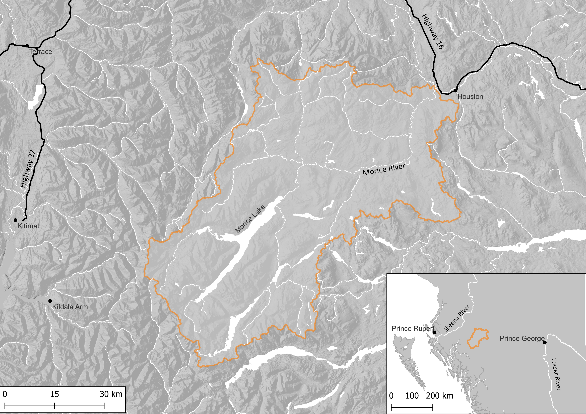

# Introduction {-}

## Purpose{-}

This plan encompasses a portion of the traditional, unceded territories of the Wet’suwet’en and Gitxsan peoples. *Wedzin Kwah* means river of clear, blue-green waters in Wet’suwet’en and refers to both the Morice River and the lower Bulkley River and their tributaries, though this plan covers only the Morice River portion of the *Wedzin Kwah*. The Bulkley River watershed is discussed in the [Bulkley River WCRP](https://bulkley-wcrp.netlify.app/).  

The purpose of the Morice River Watershed Connectivity Restoration Plan (WCRP) is to improve understanding of habitat connectivity for Sockeye Salmon (*Onchorhynchus nerka*), Chinook Salmon (*O. tschawytscha*), Coho Salmon (*O. kisutch*) and steelhead (*O. mykiss*) (herein referred to as ‘Pacific salmon and steelhead’) in the Morice River watershed and inform efforts to close knowledge gaps and plan and prioritize field assessments and restoration. 

Local data and knowledge are combined with connectivity modelling to estimate current connectivity status and identify structures that potentially block the most habitat. This informs the prioritization of field assessments to close the most significant knowledge gaps efficiently. Information from field assessments of barrier status and habitat condition are incorporated into the model, improving understanding of which barriers block the most habitat. 

This information is also used to inform and plan restoration efforts. Structure rankings inform restoration prioritization by summarizing what is known about fragmentation and showing the relative amount of habitat upstream of each barrier. Actual prioritization of restoration activities is a social decision that requires additional information, including the quality and condition of upstream habitat, the cultural importance of different areas within the watershed, and the costs and logistics of addressing each barrier relative to the ecological benefits of doing so.  

As knowledge gaps are closed and barriers are addressed, this plan is revised to summarize progress and provide updated estimates of connectivity status and the status and relative importance of remaining structures. 

## Scope  {-}

This WCRP focuses on habitat connectivity for Pacific salmon and steelhead in the Morice River watershed (Figure 4). Model outputs include an estimate of the current connectivity status along with structure ranks and counts, with Pacific salmon and steelhead connectivity estimated for both spawning habitat and rearing habitat.   

Connectivity models in this WCRP focus on longitudinal habitat fragmentation by anthropogenic structures, including all types of dams and stream crossings. Diffuse natural barriers that make entire areas impassible are not included in the models but may be used to define the scope of this WCRP. For example, a tributary that is inhospitable because of increased water temperature may be excluded from the overall spatial scope of the WCRP because restoration needs there are broader than connectivity. 

