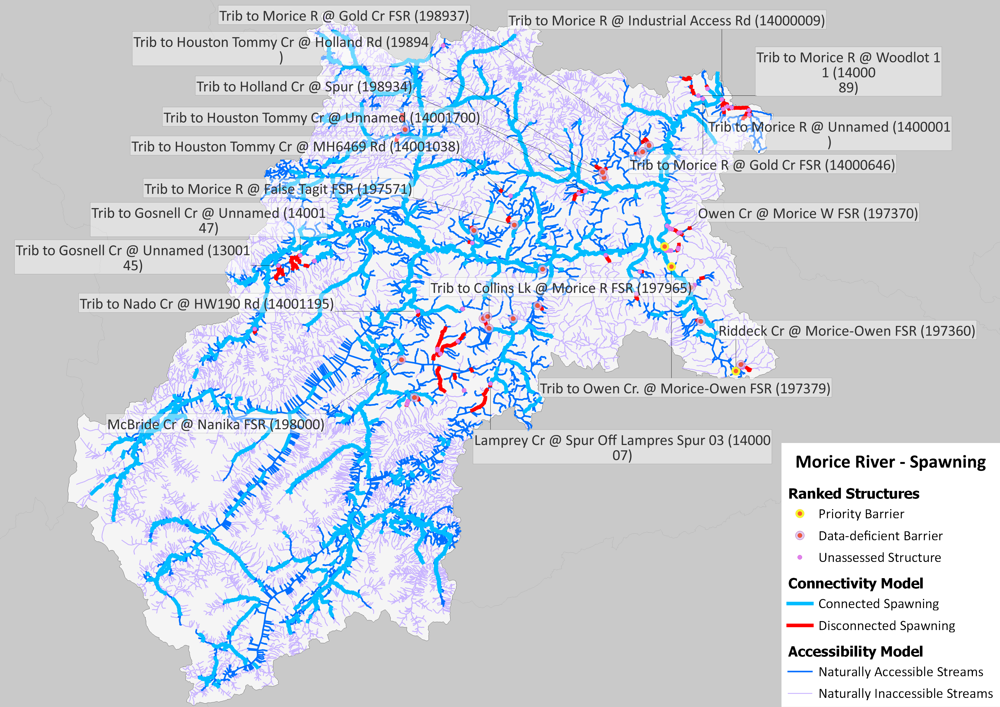
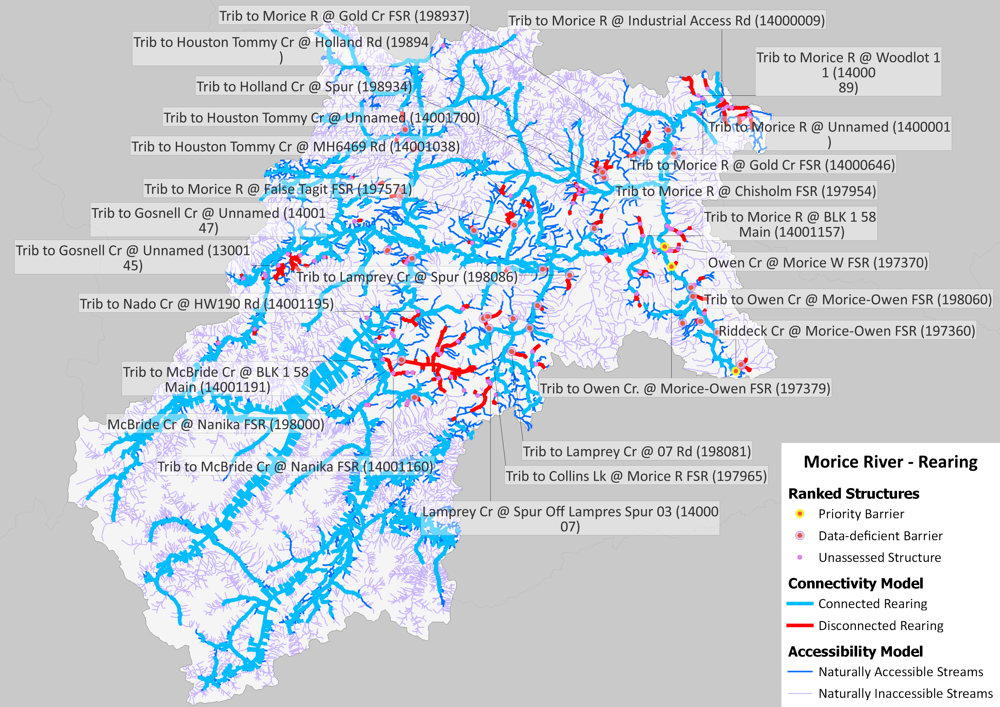
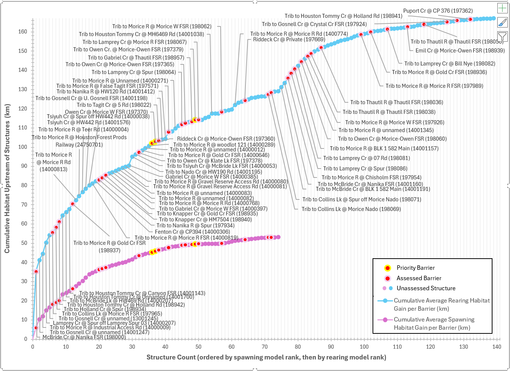

## Executive Summary {-}

The purpose of the Morice River Watershed Connectivity Restoration Plan (WCRP) is to improve understanding of habitat connectivity for Sockeye Salmon (Onchorhynchus nerka), Chinook Salmon (O. tschawytscha), Coho Salmon (O. kisutch) and steelhead (O. mykiss) (herein referred to as ‘Pacific salmon and steelhead’) in the Morice River and inform efforts to close knowledge gaps and plan and prioritize restoration. Local data and knowledge are combined with connectivity modelling to estimate current connectivity status and identify structures that potentially block the most habitat. This informs the prioritization of field assessments to close the most significant knowledge gaps efficiently. Information from field assessments of barrier status and habitat condition are incorporated into the model, improving understanding of which barriers block the most habitat, and informing restoration prioritization. As knowledge gaps are closed and barriers are addressed, this plan will be revised to summarize progress and provide updated estimates of connectivity status and the status and relative importance of remaining structures. 

In the Morice River watershed, 878.78 km of Pacific salmon and steelhead spawning habitat are currently connected to the ocean and 53.25 km are disconnected from it. This means that 94.3% of the 932.03 km of total spawning habitat is connected. 1924.33 km of Pacific salmon and steelhead rearing habitat are currently connected to the ocean and 167.07 km are disconnected from it. This means that 92.0% of the 2091.4 km of total rearing habitat is connected. 

In the Morice River watershed, 73 structures potentially disconnect spawning habitat, and 139 structures potentially disconnect rearing habitat for Pacific salmon and steelhead. Of these, 3 are identified as barriers in need of rehabilitation (priority barriers), and 136 require further field assessment. 

::: {#fig-map1}

 Map of Pacific salmon and steelhead spawning habitat and structures that are confirmed or potential barriers to fish passage in the Morice River watershed as of May 2026. Structure data were obtained from BCFishPass and the Canadian Aquatic Barriers Database (aquaticbarriers.ca). The accessibility model represents areas of the watershed that one or more of Pacific salmon and steelhead could access naturally in the absence of anthropogenic barriers. The habitat model represents the subset of accessible waterbodies that may be used by one or more Pacific salmon and steelhead for spawning. Available local knowledge and data were incorporated and overruled habitat model results. Thick red lines represent habitat considered to be fully disconnected (upstream of barriers or unassessed structures).  
:::

::: {#fig-map2}

 Map of Pacific salmon and steelhead rearing habitat and structures that are confirmed or potential barriers to fish passage in the Morice River watershed as of May 2026. Structure data were obtained from BCFishPass and the Canadian Aquatic Barriers Database (aquaticbarriers.ca). The accessibility model represents areas of the watershed that one or more of Pacific salmon and steelhead could access naturally in the absence of anthropogenic barriers. The habitat model represents the subset of accessible waterbodies that may be used by one or more Pacific salmon and steelhead for rearing. Available local knowledge and data were incorporated and overruled habitat model results. Thick red lines represent habitat considered to be fully disconnected (upstream of barriers or unassessed structures).  
:::

::: {#fig-hac}

 Habitat Accumulation Curve (HAC) showing structures in the Morice River watershed as of May 2026. Structures are ranked based on how much (km) spawning habitat for Pacific salmon and steelhead is upstream, then by amount (km) of rearing habitat is upstream. Habitat upstream of unassessed structures is considered disconnected until field assessments are completed. Structures that were excluded as passable are not shown; however, rehabilitated barriers are shown (where applicable) to demonstrate the connectivity gains achieved through implementation of this plan.
 :::

This WCRP was initiated in 2025, but concerted efforts towards connectivity assessments and planning have been ongoing in the watershed by key groups, including the Society for Ecological Restoration in Northern BC, office of the Wet’suwet’en, BC Fish Passage Technical Working Group, and Fisheries and Oceans Canada, among others, since 2020. Since then, the passability of X structures has been assessed, and further habitat assessments were completed at X of these. Several priority barriers have been identified through these processes, and plans to begin restoring connectivity are underway, with a particular focus on the Owen Creek (Bii Wenii Kwa) subwatershed.  

